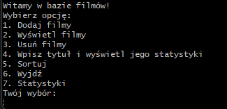
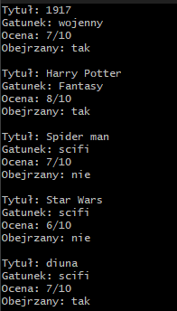

Command-line film database written in C. Supports adding, removing, searching and sorting films, with persistent file storage and basic statistics.

## Features
* **Movie Database Management** – Add and remove movies dynamically with automatic memory reallocation.
* **Browse & Search** – View the entire movie collection or search for a specific title to see its details.
* **Flexible Sorting** – Sort the database by rating, title, or genre using function pointers.
* **Statistics & Insights** – Calculate the average rating of your movies and generate a list of unwatched titles.
* **Input Validation** – Safe text input parsing and strict range-checking for ratings and watch status.